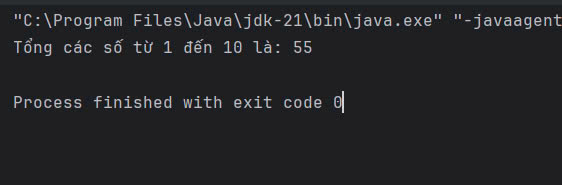
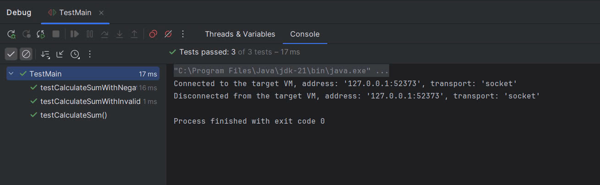
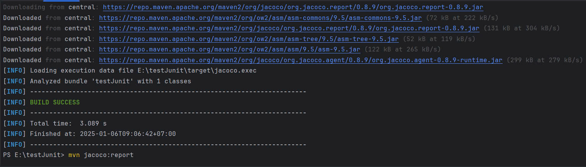
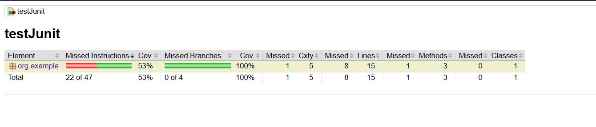
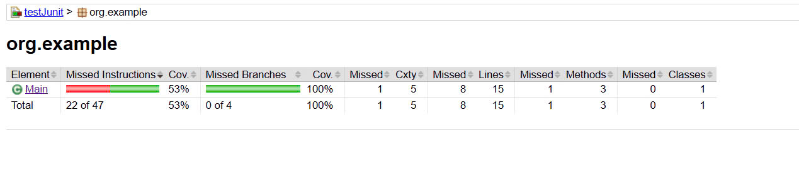
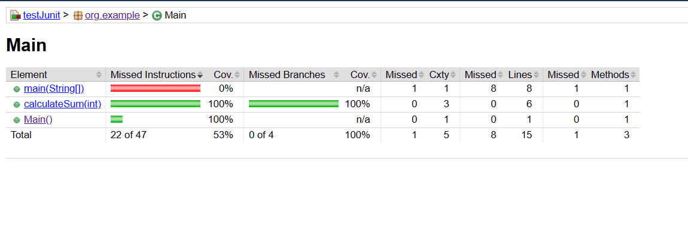
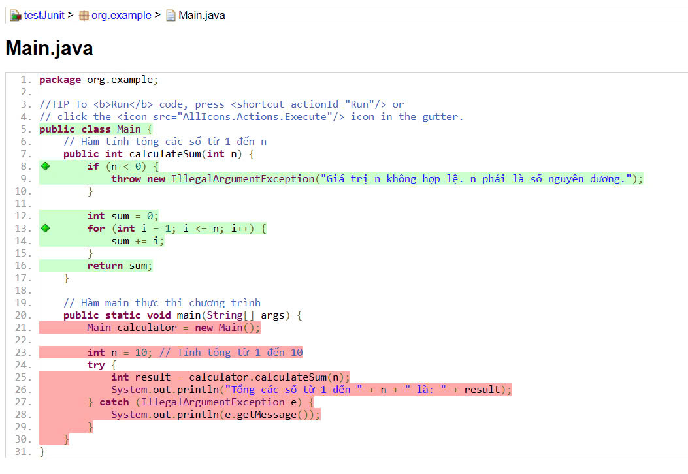

# Dự án tính tổng các số

## Mô tả

Dự án này là một chương trình Java đơn giản để tính tổng các số từ 1 đến một giá trị `n` nhập vào từ người dùng. Chương trình sử dụng vòng lặp `for` để tính toán tổng của tất cả các số từ 1 đến `n`. Ngoài ra, chương trình còn bao gồm một số kiểm tra đối với các trường hợp không hợp lệ, chẳng hạn như khi `n` là một giá trị âm hoặc khi `n` không hợp lệ.

### Các tính năng chính:

1. **Tính tổng các số**: Dự án sử dụng hàm `calculateSum(int n)` để tính tổng từ 1 đến `n`.
2. **Kiểm thử đơn vị**: Các bài kiểm thử được thực hiện với JUnit 5 để đảm bảo độ chính xác của hàm tính tổng.
3. **Phân tích độ phủ mã (code coverage)**: Dự án sử dụng **JaCoCo** để đo lường độ phủ mã của chương trình và cung cấp báo cáo chi tiết về mức độ kiểm thử mã nguồn.
4. **Trường hợp kiểm thử vòng lặp không hợp lệ**: Thêm kiểm thử cho trường hợp vòng lặp không chạy khi `i` lớn hơn `n` (ví dụ, khi `n = 0`).

### Các hàm chính trong chương trình:

- **calculateSum(int n)**: Hàm tính tổng các số từ 1 đến `n`. Nếu `n` là số âm, hàm sẽ ném ra một ngoại lệ `IllegalArgumentException`.
- **main(String[] args)**: Hàm main là điểm bắt đầu khi chương trình được chạy. Nó khởi tạo một đối tượng của lớp `Main`, gọi phương thức `calculateSum()` để tính tổng và sau đó in kết quả ra màn hình.

### Các thư mục và tệp quan trọng:
- **src/main/java**: Chứa mã nguồn chính của dự án.
- **src/test/java**: Chứa các bài kiểm thử.
- **target**: Chứa các tệp biên dịch và báo cáo độ phủ mã.

### Cấu trúc dự án

Dự án được tổ chức thành các thành phần sau:

- **Main.java**: Chứa lớp `Main` và phương thức `calculateSum()`.
- **TestMain.java**: Chứa các bài kiểm thử sử dụng JUnit 5 để kiểm tra tính năng của chương trình.
- **pom.xml**: Tệp cấu hình Maven giúp quản lý các phụ thuộc và cấu hình các plugin, bao gồm JUnit và JaCoCo.

### Các thư mục và tệp quan trọng:
- **src/main/java**: Chứa mã nguồn chính của dự án.
- **src/test/java**: Chứa các bài kiểm thử.
- **rget**: Chứa các tệp biên dịch và báo cáo độ phủ mã.

## Mã nguồn

### Main.java

```java
package org.example;

public class Main {
    // Hàm tính tổng các số từ 1 đến n
    public int calculateSum(int n) {
        int sum = 0;
        for (int i = 1; i <= n; i++) {
            sum += i;
        }
        return sum;
    }

    // Hàm main thực thi chương trình
    public stic void main(String[] args) {
        Main calculator = new Main();
        int n = 10; // Tính tổng từ 1 đến 10
        int result = calculator.calculateSum(n);
        System.out.println("Tổng các số từ 1 đến " + n + " là: " + result);
    }
}
```

### TestMain.java

```java
import org.example.Main;
import org.junit.jupiter.api.Test;
import static org.junit.jupiter.api.Assertions.assertEquals;
import static org.junit.jupiter.api.Assertions.assertThrows;

public class TestMain {

  @Test
  public void testCalculateSum() {
    Main calculator = new Main();

    // Kiểm tra tổng các số từ 1 đến 10
    assertEquals(55, calculator.calculateSum(10));

    // Kiểm tra tổng các số từ 1 đến 5
    assertEquals(15, calculator.calculateSum(5));

    // Kiểm tra tổng các số từ 1 đến 0 (kết quả là 0)
    assertEquals(0, calculator.calculateSum(0));

    // Kiểm tra tổng các số từ 1 đến 1 (kết quả là 1)
    assertEquals(1, calculator.calculateSum(1));
  }

  @Test
  public void testCalculateSumWithNegativeNumber() {
    Main calculator = new Main();

    // Kiểm tra khi số âm được đưa vào, mong đợi IllegalArgumentException
    assertThrows(IllegalArgumentException.class, () -> {
      calculator.calculateSum(-5);
    });
  }

  @Test
  public void testCalculateSumWithInvalidLoop() {
    Main calculator = new Main();

    // Kiểm tra khi vòng lặp bị sai (n < i)
    int result = calculator.calculateSum(0);
    assertEquals(0, result);  // Vòng lặp không chạy vì i > n
  }
}
```
### Hình ảnh báo cáo JaCoCo

Dưới đây là các hình ảnh minh họa quá trình sử dụng JaCoCo để đo lường độ phủ mã:

- **Hình ảnh về hàm `Main`**:
  

- **Hình ảnh về các bài kiểm thử trong `TestMain`**:
  

- **Hình ảnh quá trình xây dựng và báo cáo JaCoCo**:
  

- **Hiển thị báo cáo độ phủ mã (coverage)**:
  
  
  
  

